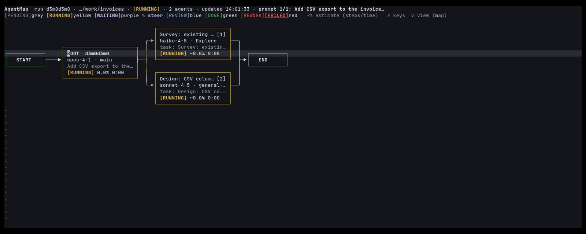

# agentmap.nvim

Claude Code のエージェントたちがいま何をしているかを、Neovim の中で図にして見る道具です。



*動画は作り物の記録（`demo/`）を再生したものです。実際の作業の記録は映っていません。*

Claude Code は、仕事の一部を別のエージェント（子）に任せることができ、子がさらに孫に任せることもあります。
agentmap.nvim はその流れを、`START` から段を順にたどって `END` に至る図にします。
誰が誰に任せたか、どれが動いていて、どれが終わり、どこで人の判断を待っているかが一目で分かります。
図は Claude Code の作業に合わせて自動で書き換わり、記録は残るので、あとから過去の実行も開けます。

[English README](README.md)

## できること

- **図で見る。** 親・子・孫を箱にして、`START ▶ 段1 ▶ 段2 ▶ … ▶ END` の順に並べます。
  同時に動いたエージェントは同じ段に縦に並びます。箱の状態は文字と色の両方で出ます：
  `[PENDING]` 灰（まだ動き始めていない）、`[RUNNING]` 黄（動いている）、`[WAITING]` 紫（あなたの答え待ち）、
  `[REVIEW]` 青（レビュー待ち）、`[DONE]` 緑（終わった）、`[REWORK]` / `[FAILED]` 赤（やり直し・失敗）。
  図は、あなたが出した指示 1 回ごとに 1 枚です。
- **任せた理由・作業の経過・報告を読む。** エージェントの詳細画面に、親がなぜその仕事を任せたか、
  子がどう進めたか（子が書いた一言と使った道具を時刻順に）、変えたファイル、最後の報告が出ます。
- **人の確認（HUMAN CHECK）。** Claude があなたに選択肢で質問したとき（AskUserQuestion）、
  紫の `[WAITING]` の箱が図に出ます。質問のきっかけになった子の箱とつながっていて、答えると緑になります。
- **レビューと差し戻し。** エージェントの仕事に `PASS`（合格）・`RETRY`（やり直し）・`ESCALATE`（人に上げる）を、
  理由と一緒に記録できます。記録は上書きせず履歴として残り、やり直しは同じエージェントの 2 回目として表示されます。
- **書き出し。** 1 回の指示ぶんの図を Markdown・HTML・PDF に保存できます（Mermaid の図と文字の木を含む）。
  報告書やプルリクエストに貼るときに使えます。
- **箱ごとの進み具合（%）。** 手順表の「済んだ数 ÷ 全部の数」を事実として出し、手順と手順の間だけを
  過去の自分の記録から推定します。推定の数字には `~` が付きます。動いているエージェントへ入る線の上を
  光の点が親から子へ流れ、エージェントが終わると数秒だけ子から親へ戻ります（下の「進み具合と光」）。
- **動いているエージェントへの修正指示。** 動いている箱で `s` を押して直してほしいことを書くと、
  子には次に道具を使う瞬間に、親（メインの Claude）には端末に打ち込む形で届きます（下の「動いているエージェントへの修正指示」）。

### 似た道具との違い

Claude Code のエージェントを見張る道具はほかにもあります（例：
[claude-code-hooks-multi-agent-observability](https://github.com/disler/claude-code-hooks-multi-agent-observability)、
[agents-observe](https://github.com/simple10/agents-observe)）。これらは手元でサーバーを動かし、ブラウザの画面で見る作りです。
agentmap.nvim は **Neovim の中で**見ます。サーバーもブラウザも要りません。図はコードの隣のタブに開き、
`t` でそのエージェントの会話の記録、`d` で変更の差分が開きます。記録は手元のディスクにある普通のファイル（1 行 1 件の JSON）です。

## しくみ

```
Claude Code ── hooks ──▶ bin/agentmap-collect ──▶ <保存先>/projects/<プロジェクト>/runs/<セッション>/hooks.jsonl
 （動きは変えない）       （Python 3、標準部品だけ）                     │
                                                                          ▼
                                                  Neovim：:AgentMap がファイルを読み、変化を見張る
```

- Claude Code には「hooks」という、決まったときに外のプログラムを呼ぶ仕組みがあります。
  agentmap.nvim はこれで小さな記録係を呼び、出来事ごとに短い 1 行を書き足します。
  記録係は失敗しても Claude Code に影響を出さず、Claude Code の動きを変えることもありません。
  例外は 1 つだけで、あなたが書いた修正指示を届けるときは、そのエージェントの次の道具の呼び出しを止めて、指示を理由として渡します。
- ほとんどの hooks は「待たせない」形で登録するので、Claude Code は記録を待ちません。
  `Stop`・`SubagentStop`・`SessionEnd` は待たせる形です（数ミリ秒）。待たせない形だと Claude Code の終了と同時に消えてしまったためと、
  終わり際にも修正指示を届けるためです。修正指示を届けるために、待たせる形の `PreToolUse` をもう 1 つ登録します。
  中身は「未配達の印のファイルがあるか」を見るだけの 1 行のシェルで、届けるものが無ければ約 2 ミリ秒で抜けます。
- Neovim はその記録を読むだけです。Claude Code が動いている間に Neovim を開いている必要はなく、あとから見られます。

## 必要なもの

| | 版 |
|---|---|
| Neovim | 0.10 以上 |
| Python | 3（標準部品だけ）。`python3` → `python` → `py -3` の順に探します |
| Claude Code | 2.1.283 〜 2.1.288 で確かめました（下の「対応している版」を参照） |
| OS | Linux・macOS・WSL。Windows で直接動かす Neovim は**試験的な対応**です |

なくても動くもの：`git`（差分の画面に使う）、[oil.nvim](https://github.com/stevearc/oil.nvim)（`w` キーでエージェントの作業フォルダを開く）、
Chrome などのブラウザ（PDF の書き出しに使う）。一覧から選ぶ画面は Neovim 標準の `vim.ui.select` を使うので、
snacks.nvim・telescope・fzf-lua・mini.pick のどれかをそのために設定していれば、その見た目になります。必須のプラグインはありません。

## 入れ方

[lazy.nvim](https://github.com/folke/lazy.nvim) の場合：

```lua
{
  "ayame0328/agentmap.nvim",
  lazy = false,                   -- 起動時に読み込む（下の説明を参照）
  opts = { lang = "ja" },         -- 画面を日本語にする
  keys = {
    { "<leader>aa", "<Cmd>AgentMap<CR>",       desc = "AgentMap: 図を開く" },
    { "<leader>ar", "<Cmd>AgentMapRuns<CR>",   desc = "AgentMap: 過去の実行" },
    { "<leader>ae", "<Cmd>AgentMapExport<CR>", desc = "AgentMap: 書き出し" },
  },
}
```

`setup()` は呼ばなくても、コマンドはそのまま使えます。`lazy = false` は消さないでください。
`keys` だけだと lazy.nvim はそのキーを押すまでプラグインを読み込まず、それまで
`:AgentMapInstallHooks` も `:checkhealth agentmap` も存在しません。起動時に読み込んでも、読むのは小さなファイル 1 つで、体感できる差はありません。

そのあと 1 回だけ、次を行います。

1. `:AgentMapInstallHooks` を実行します。Claude Code の設定ファイル（`settings.json`）に何を足すかを差分で見せ、
   書き換えてよいかを聞いてきます。ほかの設定や hooks はそのまま残り、元のファイルは
   `settings.json.bak-<日時>` として控えが残ります。何度実行しても同じ結果です。
   プラグインを新しくしたあと `:checkhealth agentmap` が「古い」と言ったら、もう一度実行してください。
2. `:checkhealth agentmap` を実行します。Neovim・Python・記録係・Claude Code のフォルダ・hooks・記録の保存先・
   なくても動く道具を順に確かめて、結果を出します。
3. Claude Code を新しく起動します。そのセッションから記録されます。
4. 下の「書き方の決まり」の文を `CLAUDE.md` に貼ります（おすすめ）。

hooks を入れる前のセッションも、Claude Code が残している会話の記録から `:AgentMapRuns` または `:AgentMapImport` で取り込めます。

### 0.1.0 から上げたとき

0.1.0 から上げたら、`:AgentMapInstallHooks` をもう一度実行してください。0.2.0 では、
TaskCreate / TaskUpdate / TaskList（親の手順表）を記録し、修正指示を届ける待たせる形の `PreToolUse` を足し、
`SubagentStop` を待たせる形に変えます。実行するまで `:checkhealth agentmap` は「古い」と出します。
`steer.mode` か `steer.at_stop` を変えたときも、hooks のコマンドに書き込まれる値なので、もう一度実行してください。

### Claude Code を使わずに試す

```sh
cd ~/.local/share/nvim/lazy/agentmap.nvim      # プラグインが入っている場所
python3 demo/replay.py --root /tmp/agentmap-demo --claude-dir /tmp/agentmap-demo-claude &
sleep 1; AGENTMAP_DIR=/tmp/agentmap-demo nvim -c AgentMap
```

上の動画と同じ作り物のセッション（約 30 秒）を、本物の記録係を通して再生します。
`sleep 1` は最初の記録が書かれるのを待つためです。無いと `:AgentMap` が記録より先に動いて
「記録された run がありません」と出ることがあります（その場合は `:AgentMap` をもう一度実行すれば開きます）。

## 使い方

### コマンド

| コマンド | すること |
|---|---|
| `:AgentMap [session_id [prompt_id]]` | いちばん新しい指示の図を開く（新しい実行が始まったら追いかける） |
| `:AgentMapRuns` | 過去の実行を一覧から選んで開く |
| `:AgentMapAgent {番号\|ID}` | エージェントの詳細 |
| `:AgentMapRefresh` | 読み直す |
| `:AgentMapExport [markdown\|html\|pdf] [保存先]` | 図に出している指示を書き出す |
| `:AgentMapReview {番号\|ID} {PASS\|RETRY\|ESCALATE\|SUBMIT} [理由]` | レビューを記録する |
| `:AgentMapInstallHooks [settings.json]` | Claude Code に記録用の hooks を登録する |
| `:AgentMapImport [session_id]` | 会話の記録から実行を取り込む |
| `:AgentMapSteer {番号\|ID} [本文]` | エージェントに修正指示を送る（本文が無ければ書く窓を開く） |

### 図の画面のキー

キーはすべて図の画面の中だけで効きます。ふだんのキーには影響しません。
どこからでも図を開くキーが欲しいときは `keymaps = { global = true }` で `<leader>aa`・`<leader>ar`・`<leader>ae` が足されます。

| キー | すること |
|---|---|
| `1`〜`9` | その番号のエージェントの詳細 |
| `Enter` | カーソルのある箱の詳細（HUMAN CHECK の箱なら質問の中身） |
| `n` / `p` | 次 / 前の箱へ移動 |
| `+` / `-` | 子を開く / 畳む |
| `z` / `BS` | このエージェントから下だけを表示 / 1 段上へ戻る |
| `t` | そのエージェントの会話の記録 |
| `d` | そのエージェントの変更の差分（git diff） |
| `w` | そのエージェントの作業フォルダへ移動 |
| `a` | レビュー（提出 / PASS / RETRY / ESCALATE / 再実行の記録 / 名前を付ける） |
| `s` | 修正指示を書く（下の「動いているエージェントへの修正指示」） |
| `e` | 書き出し |
| `r` | 読み直し |
| `R` | 過去の実行の一覧 |
| `v` | 図 ↔ 一覧（木の形）の切り替え |
| `?` | キーの一覧 |
| `q` | 閉じる |

詳細・会話の記録・差分の画面では、`BS` で 1 つ前の画面に戻り、`q` で閉じ、`Enter` でその行の
エージェント・親・HUMAN CHECK を開きます。`t` / `d` / `w` / `a` / `s` は図の画面と同じです。

図が画面の幅に入らないときは、一覧（木の形）で開きます。`v` で切り替えられます。

### 進み具合と光

箱には、経過時間の隣に進み具合が出ます。

```
[RUNNING] ~62.4% 12:34      推定：先頭に "~"
[REVIEW] 66.6% 12:34        事実だけ（3 つの手順のうち 2 つが済んだ）
[DONE] 100.0% 15:02
```

- **事実として数えるもの。** そのエージェントの手順表の「済んだ手順の数 ÷ 全部の手順の数」です。
  親（メインの Claude）は自分の手順表を TaskCreate / TaskUpdate で作り、hooks がそれを記録します。
  子はこの道具を使えない（Claude Code 2.1.288）ので、文章で `## 手順` と `手順 N 完了` を書きます（下の「書き方の決まり」）。
  詳細画面に手順の一覧が出ます。
- **推定するもの（`~`）。** いま実行中の手順の中だけです。「経過時間 ÷ 似た作業の典型的な時間」で埋めます。
  典型的な時間は、あなた自身の過去の記録の中央値です（エージェントの種類とモデルごと。手順ごとの記録がまだ無い間は、
  1 件ぶんの時間を手順の数で割ったもの）。親の実行中の手順は、動いている子の進み具合の平均で埋めます。
  数字は切り捨てで、エージェントが終わるまで 100 にはなりません。実際より進んで見えないようにするためです。
  エージェントが手順表を書き直すと、数字が下がることがあります。
- **手順表の無い箱**は、経過時間だけから推定します（経過時間 ÷ 典型的な時間、上限 95.0%）。これにも `~` が付きます。
  数字を出したくなければ `progress.no_steps = "none"` にします。
- **典型的な時間**は、終わったエージェントの記録から作ります（`:checkhealth agentmap` に件数が出ます）。
  記録が無い間は 1 件 10 分（`progress.default_ms`）とみなします。記録が増えるほど当たるようになり、
  手順ごとの時間は 0.2.0 で手順の記録が十分に溜まってから使われます。
- **毎秒の描き直し。** 動いているものがある間は、図を 1 秒ごとに描き直します（変わった行だけ）。
  典型的な時間が長いと、小数点以下は数秒に 1 回しか変わりません。図が隠れているときや別のタブにいる間は止まります。
  書き出しには、書き出した時点の値が入ります。
- **光。** 図（箱の形）では、`[RUNNING]` のエージェントへ入る線の上を、光の点が親から子の向きに流れ続けます。
  そのエージェントが終わった瞬間に、同じ線を子から親の向きに 3 秒だけ流れて止まります（`animation.back_ms`）。
  あなたの答えを待っている HUMAN CHECK へ入る線には、紫の光が流れます。動くのは色だけで、文字は書き換えません。
  光る線が無いときはタイマーも止まります。一覧（木の形）では光りません。色が 16 色より少ない端末では、光の頭を太字と反転で描きます。
- `progress = false` で箱の中の数字を消します（詳細画面と書き出しには出ます）。`animation = false` で光を完全に止めます。
- あとで推定の当たり外れを確かめるため、動いている箱ごとに 30 秒に 1 行と、終わったときに 1 行を
  `<保存先>/progress_log.jsonl` に書きます（`progress.log = false` で止まります）。誤差の中央値は `:checkhealth agentmap` に出ます。

### 画面の言葉

標準は英語です。日本語にするには `opts = { lang = "ja" }`、またはプラグインが読み込まれる前に `vim.g.agentmap_lang = "ja"` とします。

## 設定

設定できる項目と、何も指定しないときの値です。

```lua
require("agentmap").setup({
  lang = "en",                 -- 画面の言葉 "en" | "ja"。指定が無ければ vim.g.agentmap_lang を見る
  root = nil,                  -- 記録の保存先。nil → $AGENTMAP_DIR → stdpath("data") .. "/agentflow"
  claude_config_dir = nil,     -- Claude Code の設定フォルダ。nil → $CLAUDE_CONFIG_DIR → ~/.claude
  python = nil,                -- nil → "python3"・"python"・"py -3" の順に探す。文字列か表で指定もできる
  open = "tab",                -- 図を開く場所 "tab" | "vsplit" | "current"
  aux_width = 0.45,            -- 右側の詳細画面の幅（画面に対する割合）
  box_w = 26,                  -- 箱の内側の幅（文字数）
  col_gap = 7,                 -- 箱と箱の横のすき間
  mode = "auto",               -- "box"（図）| "tree"（一覧）| "auto"（入らなければ一覧）
  poll_ms = 1500,              -- ファイルの変化を見に行く間隔（ミリ秒）
  debounce_ms = 200,           -- 変化が続いたとき、まとめて描き直すまでの待ち時間
  switch_delay_ms = 15000,     -- 見ている指示が終わってから、次の指示の図へ切り替えるまでの待ち時間
  detail = { progress_max = 40, note_chars = 120, report_chars = 4000, lead_chars = 400 },
  transcript = { max_chars = 2000, max_bytes = 5e6, notes_first_bytes = 1e6, notes_max = 400 },
  review = {
    provider = "auto",         -- "auto" | "manual" | 登録した判定係の名前
    rubric = nil,              -- 自分の RUBRIC.md の場所。nil → 同梱の rubric/RUBRIC.md
  },
  keymaps = { global = false },     -- true で <leader>aa / <leader>ar / <leader>ae を足す
  hooks = { settings_path = nil },  -- nil → <claude_config_dir>/settings.json
  export = {
    html_command = nil,        -- HTML に変える別のコマンド（標準入力に Markdown、最後の引数に題名、標準出力に HTML）
    pdf_command = nil,         -- PDF にするコマンド（%{html} %{out} %{title} を置き換える）。nil → PDF は使えない
  },
  brief = { markers = nil },   -- 予約のみ（目印の言葉を変える機能は今後の予定）
  progress = {                 -- false を渡すと { enabled = false }
    enabled = true,            -- 箱に % を出す（false: 箱だけ消す。詳細画面と書き出しには出る）
    tick_ms = 1000,            -- 動いているものがある間、図を描き直す間隔（% と経過時間が動く）
    default_ms = 600000,       -- 過去の記録が無いときの、エージェント 1 件の典型的な時間（10 分）
    min_samples = 3,           -- 種類・モデルごとの中央値を使うのに要る件数
    no_steps = "time",         -- 手順表の無い箱："time" = 経過時間から推定（上限 95.0）| "none" = 出さない
    log = true,                -- 推定の答え合わせ用に <保存先>/progress_log.jsonl を書く
  },
  animation = {                -- false を渡すと { enabled = false }
    enabled = true,
    frame_ms = 100,            -- 1 コマの長さ
    period = 6,                -- 光の点と点の間隔（文字数）
    tail = 2,                  -- 光の頭の後ろの尾の長さ（文字数）
    back_ms = 3000,            -- エージェントが終わったあと、子から親へ流す時間
    max_paths = 40,            -- 同時に光らせる線の上限
  },
  steer = {                    -- false を渡すと { enabled = false }
    enabled = true,            -- false: 配達用の hooks を登録しない。s を押すと「無効」と知らせる
    mode = "deny",             -- "deny": 次の道具を止めて理由として届ける | "context": 道具はそのまま動かし、文として添える
    at_stop = true,            -- 終わろうとした瞬間にも届ける（1 回だけ止めて続けさせる）
    root_via = "terminal",     -- 親への届け方 "terminal" | "hook"
    no_terminal = "hook",      -- Claude の端末が見つからないとき "hook" | "clipboard" | "none"
    submit_delay_ms = 0,       -- 0: 本文と Enter を 1 回で送る。> 0: 本文のあと、この ms 待って Enter
    input = "window",          -- "window"（浮かせた小さな窓）| "line"（1 行の入力）
    text_max = 4000,           -- 文字数の上限
  },
})
```

`steer.mode` と `steer.at_stop` は hooks のコマンドに書き込まれます。変えたら `:AgentMapInstallHooks` をもう一度実行してください
（登録と設定が違うと `:checkhealth agentmap` が知らせます）。

保存先のフォルダ名が `agentmap` ではなく `agentflow` なのはわざとです。公開前の版の記録をそのまま読めるようにしています。
環境変数も、`$AGENTMAP_DIR` の古い名前 `$AGENTFLOW_DIR` をまだ読みます。

## 書き方の決まり

agentmap.nvim は、エージェントを**なぜ**任せたか、**何を報告したか**を、Claude が決まった形で書いたときだけ画面に出します。
推測はしません。この形で書かれていない項目は「（書かれていません）」と表示されます。
次の文を `CLAUDE.md` に貼ってください（英語版は [README.md](README.md#writing-convention)）。

```markdown
## Agent に任せる・報告する・人に確認するときの書き方（agentmap.nvim が読む決まり）

agentmap.nvim は次の見出しと項目名を機械的に読んで Neovim の画面に出す。
書かれていない項目は「（書かれていません）」と表示され、推測で補われない。

**親（Agent を起動する側）：指示文の先頭 3 行**。この順・この文字（全角の【】）で始め、その後に本文を書く。

【目的】何のためにやるか（1 行）
【任せる理由】なぜ自分でやらず任せるか（1 行）
【期待する結果】何が返ってくれば完了か（1 行）

**子（起動された側）：最後の報告**。SubagentHandback で返す場合も、その message の中にこの形で書く。

## 報告
- やったこと: 何をしたか
- 方向: どういう方針で進めたか
- 理由: なぜその方針にしたか
- 残った課題: 無ければ「なし」

作業中に利用者から修正指示を受けたときは、「方向」か「理由」に、受けた指示とそれで変えたことを書く。

**子：人の確認が要るとき**。子は利用者に直接は聞けない。作業を止め、報告の代わりにこれを書いて終わる。

## 要確認
- 今の作業: 何をしていたか
- 止まっている所: どこで先に進めないか
- 確認したいこと: 聞きたいことを 1 文で
- 選択肢:
  1. 名前 → 選んだ後の進め方
  2. 名前 → 選んだ後の進め方

**親：子の要確認を受けて AskUserQuestion するとき**

- question は「<子に付けた description> について：<確認したいこと>」の形にする
- header は description の先頭（12 文字まで）
- 各 option の label は子の選択肢の名前をそのまま。description の末尾に「→ 選んだら: <進め方>」を入れる
- 自分の判断で直接聞くときも同じ形（「〜について：」の部分は不要）
- 答えが出たら、その答えに沿って続ける。子を起動し直すときは【目的】に「<答え> を選んだため」と書く

**子：手順表（進み具合として読まれる）**。作業を始める前の最初の返答に `## 手順` と番号付きの手順
（3〜8 個）を書き、1 つ終えるたびに `手順 N 完了` の行を書く。親（メインループ）は自分の手順表を
TaskCreate / TaskUpdate で作る（Claude Code 2.1.288 では子はこの道具を使えない）。agentmap.nvim は
済んだ手順の数を事実として数え、手順と手順の間は推定（`~`）として出す。
```

読み取りの細かい規則は [docs/writing-convention.ja.md](docs/writing-convention.ja.md) にあります。
日本語の目印と英語の目印（`[Goal]`、`## Report` など）は、いつでも両方読めます。混ぜても構いません。

## 人の確認（HUMAN CHECK）

Claude が AskUserQuestion であなたに質問すると、HUMAN CHECK の箱が出ます。
質問文に子の名前（description）が入っていれば、その子の箱とつながります（上の決まりはそこに名前を書く形です）。
入っていなければ、質問した側の箱につながります。あなたがターミナルで答えるまでは紫の `[WAITING]`、
答えると緑の `[DONE]` と答えが出ます。答えないまま終わったときは灰色の `[UNANSWERED]` です。
箱の上で `Enter` を押すと、質問、選択肢ごとの「選んだらどう進むか」、子の「要確認」の中身が出ます。

## 動いているエージェントへの修正指示

箱の上で `s` を押すか、`:AgentMapSteer {番号|ID} [本文]` を実行して、エージェントに直してほしいことを書きます。
小さな窓が開くので、書いたら `<C-s>`・`:w`・ノーマルモードの `Enter` のどれかで送ります。`q` で取り消します。
届け方は箱によって変わります。

| 箱 | 届け方 |
|---|---|
| 動いている子・孫・レビュー係 | **hooks で届ける。** 指示はその実行のフォルダに置かれ、そのエージェントが次に道具を使おうとした瞬間に、`PreToolUse` の hook がその道具を止めて、指示を理由として返します。道具を使わずに終わろうとしたときは、`SubagentStop` で 1 回だけ止めて指示を渡します（`steer.at_stop`）。 |
| 親（ROOT、メインの Claude） | **端末に打ち込む。** この Neovim の中の `:terminal` で動いている `claude` に、`[AgentMap] <本文>` と Enter を送ります。Claude Code は作業中に打たれた文字を次の切れ目で読みます。止まっていれば新しい指示として始まります。 |
| 終わった箱（`DONE` / `REWORK` / `FAILED`） | **親の端末へ、やり直しの依頼を送る。** 文面は `[AgentMap] エージェント [3]「<名前>」（id …、10:31 終了）をやり直してください：<本文>。同じ任せ方で、何が変わったかを報告してください。` です（英語の画面なら英語）。終わったエージェント自身にはもう届きません。差し戻し（REWORK）は自動では記録しません。やり直すかは親が決めます。 |

子に指示が届くと、その親にも 1 回だけ知らせが届きます。届け方は、その親への普通の指示と同じです
（親がメインの Claude なら端末、無ければ hooks。親が子エージェントなら hooks）。文面は
`[AgentMap] The user sent this instruction directly to your sub-agent [2] "<名前>": <本文>. If it also affects other sub-agents or your plan, update them.`
のような形です（モデル向けの文なので、画面の言葉によらず英語です）。親がもう終わっていれば送りません。子には、報告の中で受けた指示に触れるよう頼みます。

知っておくこと：

- 子には、指示が `PreToolUse:Write hook error: [AgentMap] Steering instruction from the user, typed in Neovim while you
  were working (this is not a tool error): …` という 1 行で見えます。「hook error」の語は Claude Code が付けるもので消せません。
  止めた道具の呼び出しは実行されず、子は指示を読んでから呼び直します（または別の道具を使います）。
  `steer.mode = "context"` にすると、道具は止めずに、指示を文として添えます。
- 終わり際に止めると、Claude Code の端末に `Stop hook error occurred` と出ます。止めるのが 8 回続くと
  Claude Code が強制的に終わらせる（`CLAUDE_CODE_STOP_HOOK_BLOCK_CAP`）ので、止まり続けることはありません。
- エージェントはたいてい指示に従いますが、必ずではありません。試したところ、親を Haiku で動かすと hooks で届けた指示に
  6 回中 1 回も従わず、Opus と Sonnet は従いました。親には端末から届けるのはこのためです。
- Claude の端末が見つからないとき（別の端末の窓で Claude Code を動かしているときなど）は、親が次に道具を使う瞬間に
  hooks で届けます（`steer.no_terminal = "hook"`）。クリップボードにコピーする（`"clipboard"`）、送らない（`"none"`）も選べます。
  その実行のフォルダ（かその親）で動いている Claude の端末を使います。複数あって決まらないときや、別のフォルダの端末しか無いときは、1 回だけ選んでもらいます。
  送ったあとは端末を一度見てください。Claude Code が別の質問（フォルダを信頼するかの確認など）で止まっていても、agentmap.nvim には分かりません。
- 箱の 4 行目に、届く前の指示があれば ` ✎1`（紫）、届けてから 1 分の間は ` ✎`（緑）、
  届く前にエージェントが終わってしまったら ` ✎!`（赤）が出ます（そのときは知らせも出ます）。
  詳細画面に指示の一覧と全文が出ます（行の上で `Enter` を押すと全文を開きます）。まだ届いていない指示は
  `s` →「未配達を取り消す」で取り下げられます。書き出しには「修正指示」の節が入ります。
- 置き場所：届く前の指示は `<保存先>/projects/<プロジェクト>/runs/<セッション>/steer/<エージェント>-<時刻>.json`
  （自分だけが読み書きできる 0600）、`<保存先>/steer.pending` は hooks のシェルが見る印です。届けたものは
  `*.delivered.json` に名前が変わります。同じユーザーで動くプログラム（エージェントの Bash を含む）はこのファイルを書けるので、
  覚えのない指示が届いていないか、詳細画面の全文で確かめられます。

## レビューと判定係

エージェントの上で `a` を押すか `:AgentMapReview` で、`PASS`・`RETRY`・`ESCALATE` を理由と一緒に記録します。
最終的に決めるのはいつもあなたです。レビューはその実行の記録と `<保存先>/review_log.jsonl` に、
使った判定基準の版と一緒に残ります。同梱の判定基準 [rubric/RUBRIC.md](rubric/RUBRIC.md) は 5 つの問いでできています。
自分の基準を使うときは `review.rubric` にその場所を書きます。

「判定係」を登録すると、あなたが選ぶ前に判定を**提案**させることができます。

```lua
require("agentmap.review").register("my-judge", {
  -- 任意：この PC で使えるかどうかを答える（使えないときは理由も）
  available = function() return vim.fn.executable("my-judge") == 1, "my-judge が見つかりません" end,
  -- ctx = { agent, agent_id, state, run, rubric }。cb({ verdict = "PASS", reason = "…" }) か cb(nil) を呼ぶ
  evaluate = function(ctx, cb) cb({ verdict = "PASS", reason = "試験が通っている" }) end,
})
```

`review.provider = "auto"` なら、登録された判定係のうちこの PC で使える最初のものを使い、無ければあなたが手で選びます。
提案があっても最後に選ぶのはあなたで、提案と選んだ答えが並べて記録されます。

## 書き出し

`:AgentMapExport`（図の画面では `e`）で、図に出している指示 1 回ぶんを書き出します。
中身は、全体の概要、Mermaid の図と文字の木、各エージェントの任せた理由と報告、人の確認、レビュー、変えたファイル、使った道具です。
保存先を指定しなければ `<保存先>/projects/<プロジェクト>/runs/<セッション>/exports/` に置かれます。

- **Markdown**：いつでも使えます。
- **HTML**：CSS を中に含んだ 1 つのファイル（明るい配色・暗い配色の両方に対応）。同梱の小さな変換係で作るので、ほかの道具は要りません。
  pandoc などを使いたいときは `export.html_command` に書きます。
- **PDF**：HTML を PDF にするコマンドを `export.pdf_command` に書くと使えます。例：

```lua
-- Linux
export = { pdf_command = { "google-chrome", "--headless=new", "--disable-gpu",
  "--no-pdf-header-footer", "--print-to-pdf=%{out}", "%{html}" } }
-- macOS
export = { pdf_command = { "/Applications/Google Chrome.app/Contents/MacOS/Google Chrome",
  "--headless=new", "--no-pdf-header-footer", "--print-to-pdf=%{out}", "%{html}" } }
-- Windows（Edge）
export = { pdf_command = { "C:/Program Files (x86)/Microsoft/Edge/Application/msedge.exe",
  "--headless=new", "--no-pdf-header-footer", "--print-to-pdf=%{out}", "%{html}" } }
-- WSL から Windows の Chrome を使う（ファイルの場所は自動で Windows の形に直します）
export = { pdf_command = { "/mnt/c/Program Files/Google/Chrome/Application/chrome.exe",
  "--headless=new", "--disable-gpu", "--no-pdf-header-footer", "--print-to-pdf=%{out}", "%{html}" } }
```

## 何を保存し、何を保存しないか

記録は手元のディスクの `<保存先>`（標準は `stdpath("data")/agentflow`）にだけ置かれ、どこにも送られません。

保存するもの（出来事ごと）：

- セッション・指示・エージェントの ID と種類、作業フォルダ、出来事の名前、時刻
- あなたの指示と、各エージェントへの指示の先頭 200 文字。決まりの 3 行（`【目的】` `【任せる理由】` `【期待する結果】`、各 300 文字まで）
- エージェントの名前（description）・種類・モデル
- 道具の名前と対象：Write / Edit ならファイルの場所、Bash ならコマンドの 1 行目（120 文字まで）
- AskUserQuestion の質問・選択肢・答え（長いものは切る）
- 子の最後の報告（2000 文字まで）と、最後の発言の先頭 200 文字
- 手順表：TaskCreate の件名と `## 手順` の各項目（各 60 文字まで）と、その状態の変化。TaskCreate の説明文（description）は保存しない
- **修正指示の本文はあなたが書いたまま**（伏せ字にしない。4000 文字まで）。`events.jsonl` と `steer/*.delivered.json` に残る
- `progress_log.jsonl`（推定の値と実際にかかった時間。文章は入らない）と `stats.json`（かかった時間の中央値）

保存しないもの：

- 指示の全文、道具の実行結果、ファイルの中身、Read / Grep / Web の道具の呼び出し
- 鍵やパスワードらしい文字列：`api_key=…`、`token: …`、`password=…`、`Bearer …`、`sk-…`、`ghp_…`、
  `github_pat_…`、`AKIA…`、`xox…-`、`AIza…` は、書き込む前に `***` に置き換えます（伏せ字）

詳細画面と会話の記録の画面は、開いたときに Claude Code 自身の会話の記録（`claude_config_dir` の中）を読みます。写しは作りません。
書き出しのファイルは、あなたが書き出したときにだけ作られます。
記録を消したいときは、`<保存先>/projects/` の下のフォルダを消してください。

## コンテナ・WSL・Windows

- **Claude Code をコンテナ（devcontainer・Docker・サンドボックス）の中で動かし、Neovim は外で使う場合**：
  [docs/containers.md](docs/containers.md)（英語）を見てください。両方から見える共有フォルダが 1 つ要ります。
- **WSL**：Neovim と Claude Code を両方 WSL の中で動かすなら、Linux と同じように使えます。
- **Windows で直接動かす Neovim**：v0.1.0 では**試験的な対応**です。hooks のコマンドは bash 向けの形で書きます
  （Windows の Claude Code は Git Bash で hooks を動かします）。うまく動かないところがあれば知らせてください。

## 対応している版

Claude Code が hooks に渡す中身には版の番号が入っていません。そのため、実際の hooks の中身を採取して確かめています（`tests/fixtures/`）。

| Claude Code | 確かめた日 | 備考 |
|---|---|---|
| 2.1.283 〜 2.1.286 | 2026-10-01 | `tests/fixtures/` の実物の hooks の中身は 2.1.283 から採取 |
| 2.1.288 | 2026-10-04 | TaskCreate / TaskUpdate / TaskList の中身。修正指示（止めたときの文言、`stop_hook_active`、動いている `claude` への打ち込み） |

使う hooks：`SessionStart`、`UserPromptSubmit`、`PreToolUse`（Agent・AskUserQuestion。修正指示用に全部の道具・待たせる形でもう 1 つ）、
`PostToolUse`（Agent・AskUserQuestion・Write・Edit・MultiEdit・NotebookEdit・Bash・EnterWorktree・ExitWorktree・TaskCreate・TaskUpdate・TaskList）、
`PostToolUseFailure`（Agent・AskUserQuestion）、`SubagentStart`、`SubagentStop`、`Stop`、`SessionEnd`。
知らない種類の出来事は無視するので、Claude Code に hooks の種類が増えても壊れません。
許可の判断を返せる `PermissionRequest` は使わないので、agentmap.nvim が何かを許可することはありません。
道具の呼び出しを止めるのは、あなたが書いた修正指示を届けるときだけです（`steer.enabled = false` でその hook を外せます）。

2.1.288 での注意：子は TaskCreate を使えないので、`## 手順` の書き方で手順表を作ります。止めた道具の呼び出しは、
モデルには `PreToolUse:<道具> hook error: <理由>` と見えます。hooks で届けた指示に親が従うかは、モデルによって違います。

記録の形式には版の番号（`_v`）があり、古い版で書いた記録も読めます。

## いまの状態と今後

v0.1.0 は、作者が自分の仕事のために作った道具を公開した最初の版です。v0.2.0 で進み具合・光・修正指示を足しました。
Issue への返事は週に数回で、約束はできません。

予定していること：

- **Codex** への対応（仕組みは用意してあり、いまは Claude Code だけ）
- 書き方の決まりの**目印の言葉を自分で決める**設定（`brief.markers`。いまは予約だけ）
- 古い記録の自動の片付け
- Windows で直接動かす Neovim：不具合を直して、試験的な対応を外す
- 手順ごとの典型的な時間は、記録が溜まるほど当たるようになる（0.2.0 から記録を始める）

不具合の報告には、`:checkhealth agentmap` の結果と `hooks.jsonl` の数行があると助かります（個人の情報が入っていないか先に確かめてください）。
[CONTRIBUTING.md](CONTRIBUTING.md)（英語）も見てください。

## ライセンス

[MIT](LICENSE)
